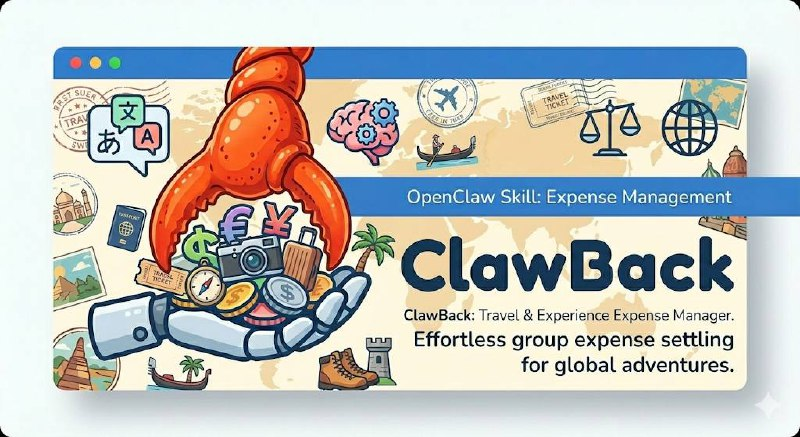

<div align="center">



# ClawBack 🧾

**Group expense splitting that understands how you actually talk.**

[](https://github.com/yhyatt/clawback/actions/workflows/ci.yml)
[](https://codecov.io/gh/yhyatt/clawback)
[](https://github.com/yhyatt/clawback)
[](LICENSE)
[](https://clawhub.com/skills/clawback-expense)
[](CONTRIBUTING.md)

No forms. No dropdowns. No app to install.  
Just say what happened — in English or Hebrew — and ClawBack handles the rest.

</div>

---

## The problem with expense apps

Every expense app makes you fill in fields.  
Tap payer. Type amount. Select currency. Choose split method. Add participants one by one.

Nobody talks like that. And when you're at a restaurant with friends, nobody wants to.

---

## ClawBack is different

```
Dan paid ₪340 for dinner, split equally between Dan, Yonatan, Louise, and Zoe
```

```
דן שילם 340 שקל על ארוחת ערב, מחולק שווה בין דן, יונתן, לואיז וזואי
```

Both inputs. Same result. Instantly.

No app. No signup. Just a WhatsApp or Telegram message and a shared Google Sheet everyone can see.

---

## ✨ What Makes It Different

<table>
<tr>
<th>Feature</th>
<th>ClawBack</th>
<th>Splitwise</th>
<th>Tricount</th>
</tr>
<tr>
<td>🗣️ Natural language input</td>
<td>✅</td>
<td>❌</td>
<td>❌</td>
</tr>
<tr>
<td>🌍 Hebrew / multilingual</td>
<td>✅</td>
<td>❌</td>
<td>❌</td>
</tr>
<tr>
<td>💬 WhatsApp & Telegram native</td>
<td>✅</td>
<td>❌</td>
<td>❌</td>
</tr>
<tr>
<td>📊 Google Sheets backend</td>
<td>✅</td>
<td>❌</td>
<td>❌</td>
</tr>
<tr>
<td>⚡ Zero-LLM reads (instant, free)</td>
<td>✅</td>
<td>—</td>
<td>—</td>
</tr>
<tr>
<td>💱 Multi-currency with live FX</td>
<td>✅</td>
<td>Paid</td>
<td>❌</td>
</tr>
<tr>
<td>🔓 Open source</td>
<td>✅</td>
<td>❌</td>
<td>❌</td>
</tr>
<tr>
<td>🧠 Optional LLM financial audit (batched, ~$0.01)</td>
<td>✅</td>
<td>❌</td>
<td>❌</td>
</tr>
</table>

---

## 🚀 Features

### 🗣️ Natural Language Parsing
Describe expenses the way you'd tell a friend. ClawBack parses free-text in English and Hebrew using a regex-based parser — **no LLM, no API call, no cost** on writes.

```
"Alice paid $200 for the hotel, split between Alice and Bob"
"עמית שילם 1 200 שקל על המלון, מחולק בין עמית לרון"
```

### 💱 Multi-Currency with Live FX
Support for ILS (₪), USD ($), EUR (€), GBP (£), JPY (¥) and more.  
Live exchange rates via [frankfurter.app](https://www.frankfurter.app) — **free, no API key needed**.

```
"Sara paid €85 for wine" → converted to trip base currency automatically
```

### ⚖️ Flexible Splits
Equal split, split among specific people, or custom amounts per person.

```
"Dan paid ₪500. Yonatan owes 200, Sara owes 150, Dan keeps the rest"
```

### ⚡ Zero-LLM Reads
Balance checks, summaries, and participant lists are **instant and free**.  
No API call. No latency. No cost. Reads are pure local computation.

### ✅ Confirmation Workflow
Writes show a structured preview before committing. User confirms with "yes" or cancels with "no". Pending confirmations expire after 5 minutes.

```
📋 Confirm expense
  Payer: Dan  Amount: ₪340.00
  Split: Yonatan ₪113.33 · Louise ₪113.33 · Zoe ₪113.34
  Reply yes to confirm, no to cancel.
```

### 📊 Google Sheets Backend
Every trip has a shared Google Sheet. All participants can see live balances without installing anything.

### 🔢 Decimal-Safe Arithmetic
All financial math uses Python `Decimal` — never floats. No rounding surprises.

### 🧠 Optional LLM Financial Audit
After parsing, an optional LLM layer can verify confirmation messages for financial accuracy — checking amounts, payers, and per-person arithmetic. Runs as a **batched** call (many cases per request) keeping cost to ~$0.01 for 130 edge cases. Never runs in production or CI — only when you want an independent check. See [LLM Confirmation Audit](#-optional-intelligence-llm-confirmation-audit) for details.

### 📋 Audit Log
Append-only ledger. Full history always preserved. Undo always available.

---

## 🔥 How It Works (Architecture)

```
User message (natural language)
        │
        ▼
   Regex Parser           ← no LLM, no cost
        │
        ▼
  Command Handler
   ├── Reads ──────────── instant local compute, zero API calls
   └── Writes ─────────── confirmation preview → user says yes → ledger update → Sheets sync
```

**Writes** use the regex parser — no LLM involved at any step. The confirmation message is template-rendered. The parser handles Hebrew names, space-separated thousands (`1 200`), and mixed-currency inputs natively.

---

## 📦 Installation

```bash
pip install clawback
```

Or install the [OpenClaw skill](https://clawhub.com/skills/clawback-expense) and let your AI assistant handle it:

```bash
clawhub install clawback-expense
```

### First-time setup

```bash
# Initialize a trip
clawback handle $CHAT_ID "kai trip Greece Vacation base EUR"

# Add participants
clawback handle $CHAT_ID "kai add participants Dan, Sara, Yonatan, Louise"
```

---

## 💬 Usage Examples

```bash
# Add an expense
clawback handle $CHAT_ID "Dan paid ₪340 for dinner, split equally"

# Custom split
clawback handle $CHAT_ID "Sara paid €200. Dan owes 80, Yonatan owes 70, Sara keeps the rest"

# Check balances (free, instant — no LLM)
clawback handle $CHAT_ID "balances"
clawback handle $CHAT_ID "balances in USD"

# Settle a debt
clawback handle $CHAT_ID "Yonatan paid Dan ₪120"

# Full trip summary
clawback handle $CHAT_ID "summary"

# Undo last action
clawback handle $CHAT_ID "undo"
```

---

## 🧠 Optional Intelligence: LLM Confirmation Audit

ClawBack is **zero-LLM by design** for all production operations — parsing, splitting, and balance reads are pure regex + arithmetic. No API calls. No cost. No latency.

But money is sensitive. When you want an independent check that confirmation messages are financially accurate, ClawBack has an optional LLM audit layer:

```
User input (natural language)
        │
        ▼
   Regex Parser      ← always runs, zero cost
        │
        ▼
  Confirmation       ← template-rendered, zero cost
  message
        │
        ▼ (optional, manual trigger only)
   LLM Audit         ← verifies amounts, payer, per-person splits are correct
```

### How it works

The auditor batches **multiple confirmation messages into a single LLM call** — not one call per expense. For 130 oracle test cases, this produces ~11 batched calls total (~$0.01, ~100 seconds).

The LLM is asked to verify:
- Amount and currency match the original input
- Payer is correct
- Per-person split amounts are arithmetically correct (the model checks the maths)
- Clarifying questions are appropriate when participants were unspecified

This runs **after** parsing — the LLM never sees raw user input, only the already-rendered confirmation. It's a financial proofreader, not a parser.

### When to run it

| Scenario | Recommendation |
|----------|---------------|
| Normal day-to-day use | ✅ No audit needed — parser + Decimal arithmetic is correct |
| After changing parser logic | ✅ Run oracle audit to verify edge cases |
| Suspicious confirmation message | ✅ Run single audit manually |
| CI on every push | ❌ Never — adds cost and latency with no benefit |

### Running the audit

```bash
# Requires ANTHROPIC_API_KEY
pytest -m oracle --haiku

# Or trigger manually in GitHub Actions:
# Actions → "Oracle Validation" → Run workflow
```

---

## 🧪 Testing

```bash
# Install dev dependencies
pip install -e ".[dev]"

# Run the full test suite (517 tests, no API calls, no LLM)
pytest

# Run with coverage
pytest --cov=clawback --cov-report=term

# Run oracle edge-case suite (130 edge cases — Hebrew names, decimal math, duplicates, etc.)
pytest -m oracle

# Run oracle + LLM validation of confirmation message quality
# Requires ANTHROPIC_API_KEY. Runs ~11 batched calls (~100s, ~$0.01 total).
pytest -m oracle --haiku
```

> **CI runs the full 517-test suite with no external API calls.**  
> The `--haiku` LLM financial audit is optional and never runs in CI. It batches all oracle cases into ~11 LLM calls (~$0.01 total) to verify that confirmation messages are arithmetically accurate. Trigger it manually from Actions → "Oracle Validation" after parser changes, or run locally with `ANTHROPIC_API_KEY` set.

---

## 🤖 OpenClaw Skill

ClawBack ships as an [OpenClaw](https://openclaw.ai) skill. Install it and your AI assistant can parse expenses from WhatsApp or Telegram automatically — no manual `clawback handle` commands needed.

```bash
clawhub install clawback-expense
```

Once installed, just talk naturally in your group:

> *"Dan paid ₪340 for dinner, split equally"*

Your assistant parses it, shows a confirmation, and logs it to the shared Sheet on approval.

---

## 🗂️ Project Structure

```
clawback/
├── src/clawback/
│   ├── parser.py       # Natural language → structured command (regex, no LLM)
│   ├── commands.py     # Command execution + confirmation workflow
│   ├── ledger.py       # Append-only ledger + balance computation
│   ├── sheets.py       # Google Sheets sync
│   ├── fx.py           # Live FX rates (frankfurter.app)
│   ├── templates.py    # Confirmation message templates
│   ├── models.py       # Pydantic data models
│   ├── state.py        # Trip state persistence
│   └── cli.py          # CLI entrypoint
├── tests/              # 517 tests (unit + oracle edge cases)
├── deploy/
│   └── openclaw-skill/ # OpenClaw skill package
└── pyproject.toml
```

---

## 📄 License

MIT © [Yonatan Hyatt](https://github.com/yhyatt)
